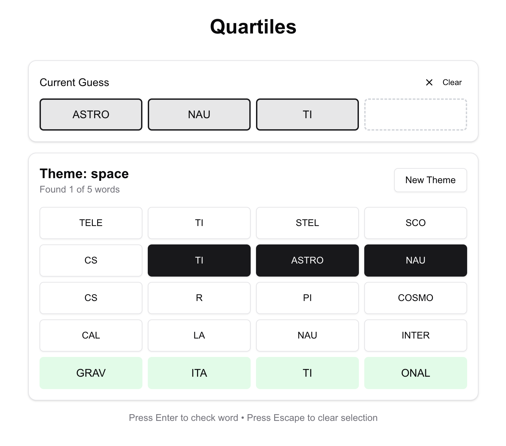

# OpenQuartiles Word Game

OpenQuartiles is an engaging word puzzle game where players reconstruct themed words from scrambled chunks. Powered by AI, it generates unique word sets based on any theme you choose.

[Play OpenQuartiles](https://openquartiles.vercel.app/)



## How to Play

1. Enter a theme (e.g., "space", "food", "animals")
2. The game generates 5 themed words, each split into 4 chunks
3. Click on chunks to build your word
4. Press Enter to check if your word is correct
5. Press Escape or click Clear to reset your current guess
6. Find all 5 words to win!

Each generated word:

- Is related to your chosen theme
- Is 10-14 letters long
- Is split into 4 logical chunks
- Can only be used once

## Features

- 🎯 AI-generated themed word sets
- 🎮 Intuitive drag-and-drop interface
- ⌨️ Keyboard shortcuts support
- 🎨 Clean, modern UI using shadcn components
- 📱 Responsive design for all devices
- 🔄 Play again with same theme option
- ✨ Immediate feedback on guesses

## Technology Stack

- Next.js 16.0.3 (App Router)
- React 19
- TypeScript
- Tailwind CSS 4
- shadcn/ui + Radix UI
- Zustand
- Vercel AI SDK (`ai`, `@ai-sdk/openai`, `@ai-sdk/rsc`)
- OpenAI SDK (`openai`)
- Vercel hosting

## Local Development

### Prerequisites

- Node.js 18.17 or later
- OpenAI API key

### Setup

1. Clone the repository:

```bash
git clone https://github.com/brown2020/openquartiles.git
cd openquartiles
```

2. Install dependencies:

```bash
npm install
```

3. Create a `.env.local` file and add your OpenAI API key:

```
OPENAI_API_KEY=your_openai_api_key
```

4. Run the development server:

```bash
npm run dev
```

5. Open [http://localhost:3000](http://localhost:3000) in your browser

### Available Scripts

- `npm run dev` - Start development server
- `npm run build` - Build for production
- `npm start` - Start production server
- `npm run lint` - Run ESLint
- `npm run format` - Format code with Prettier

## Project Structure

```
src/
├── app/                   # Next.js app router
├── components/
│   ├── game/             # Game-specific components
│   │   ├── GameArea.tsx  # Main game component
│   │   ├── GameBoard.tsx # Game board display
│   │   └── ...
│   └── ui/              # shadcn components
├── lib/
│   ├── actions.ts       # Server actions
│   ├── types.ts         # TypeScript types
│   └── utils.ts         # Utility functions
└── stores/              # Zustand stores
```

## Key Components

- `GameArea`: Main game container and state management
- `GameBoard`: Displays word chunks and found words
- `CurrentGuessDisplay`: Shows current word being built
- `GameHeader`: Shows theme and game controls

## Contributing

Contributions are welcome! Please follow these steps:

1. Fork the repository
2. Create a new branch: `git checkout -b feature/your-feature`
3. Make your changes and commit: `git commit -m 'Add some feature'`
4. Push to the branch: `git push origin feature/your-feature`
5. Submit a pull request

## License

This project is licensed under the GNU Affero General Public License v3.0. See the [LICENSE.md](LICENSE.md) file for details.

## Contact

For questions or suggestions, please contact:

- Email: info@ignitechannel.com
- GitHub Issues: [Create an issue](https://github.com/brown2020/openquartiles/issues)

## Acknowledgments

- Built with [Next.js](https://nextjs.org/)
- UI components from [shadcn/ui](https://ui.shadcn.com/)
- Word generation powered by [OpenAI](https://openai.com/)
- Deployed on [Vercel](https://vercel.com/)

## Support

If you like this project, please give it a ⭐ on GitHub!

## Deploy Your Own

You can deploy your own version of OpenQuartiles to Vercel with one click:

[](https://vercel.com/new/clone?repository-url=https%3A%2F%2Fgithub.com%2Fbrown2020%2Fopenquartiles&env=OPENAI_API_KEY)

Remember to add your OpenAI API key to the environment variables in your Vercel project settings.
